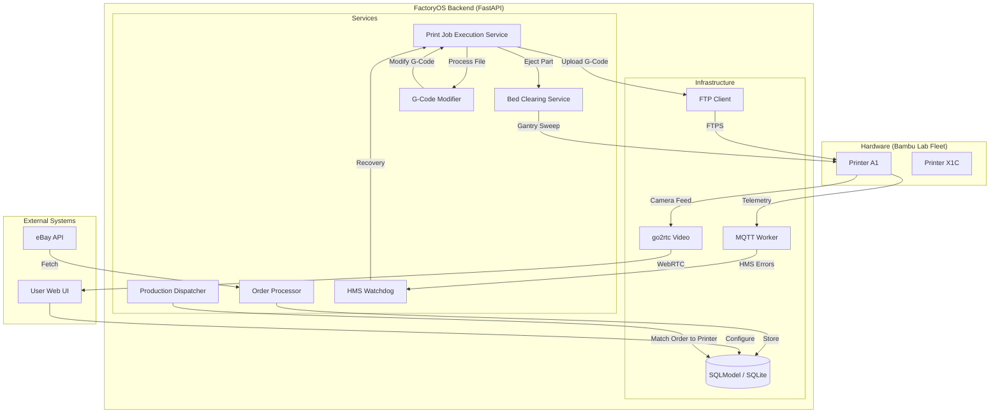

# FactoryOS v2.0 Architecture Mapping

## Executive Summary
FactoryOS is an autonomous Manufacturing Execution System (MES) designed to manage a fleet of 3D printers. It automates the entire lifecycle of a production part: from external order retrieval (eBay/Etsy) to file processing, dispatching, execution, and physical bed clearing (ejection).

---

## 🏗️ System Architecture

---

## 📂 Directory Structure Highlights

### `app/` (Backend Core)
- `core/`: Config (`settings.py`), Database engine, and Redis connectors.
- `models/`: Database entities (SQLModel).
    - `core.py`: `Printer`, `Job`, `Product` models.
    - `order.py`: Order entities and status enums.
    - `filament.py`: AMS slots and material profiles.
- `services/`: Business logic layer.
    - `production/`: High-level 
        - `dispatcher.py`: The "Brain". Matches `PENDING` jobs to `IDLE` printers based on filament and capability.
        - `order_processor.py`: Synchronizes with external APIs.
    - `printer/`: Hardware interaction.
        - `commander.py`: Low-level MQTT commands (`START`, `STOP`, `PAUSE`).
        - `mqtt_worker.py`: Async listener for printer telemetry and HMS codes.
        - `kinematics.py`: Specialized movement logic for ejection (Gantry Sweep).
    - `logic/`: File manipulation.
        - `gcode_modifier.py`: Dynamic seeding, auto-eject injection, and tool renaming.
        - `hms_parser.py`: Decodes hex codes from Bambu Lab into human-readable errors.
- `routers/`: API endpoints organized by domain (printers, orders, system).

### `scripts/` (DevOps & Testing)
- `test_e2e_zylinder_sweep.py`: Full system integration test for ejection strategy.
- `verify_gantry_sweep.py`: Targeted kinematic verification.
- `seed_zylinder_skus.py`: Database initialization for testing.

---

## 🔄 Core Data Flow

1.  **Ingestion**: `OrderProcessor` polls eBay API, maps external listings to internal `ProductSKU`s, and creates `Order` objects.
2.  **Synthesis**: `dispatcher.py` identifies `OPEN` orders, checks material requirements against printer `ams_slots`, and creates a `Job`.
3.  **Preparation**:
    - `PrintJobExecutionService` retrieves the base 3MF/G-code.
    - `GCodeModifier` injects a dynamic seed (cache bust) and appends the `A1_GANTRY_SWEEP` sequence.
4.  **Execution**: `PrinterCommander` uploads the file via FTPS and triggers the print.
5.  **Monitoring**: `HMS Watchdog` listens for "Step Loss" or "Collisions". If the gantry sweep fails, it triggers an auto-recovery retry with increased motor current.
6.  **Completion**: Upon `FINISH` event, `BedClearingService` waits for bed cooldown (`COOLDOWN`) and executes the physical ejection.

### `frontend/` (Next.js Application)
- `src/app/`: Next.js App Router. Contains page layouts and main views (e.g., `/dashboard`, `/printers`).
- `src/components/`: Modular UI components.
    - `PrinterCard.tsx`: Standardized card representing a printer's state, actions, and progress.
    - `PrinterCameraDialog.tsx`: Real-time video player for printer monitoring.
- `src/hooks/`: Custom React hooks, notably `usePrinterAction` for optimistic status updates via TanStack Query.
- `src/lib/`: Functional utilities and API clients (`api-client.ts`).

---

## 🛠️ Tech Stack
- **Backend API**: FastAPI + Uvicorn
- **Framework (Frontend)**: Next.js (App Router) + Tailwind CSS
- **DB**: SQLModel (SQLAlchemy) + SQLite/MySQL
- **State Management**: TanStack Query (React Query)
- **Async**: Python `asyncio` for production loops
- **Communication**: `aiomqtt` (Telemetry), `ftplib` (File Uploads)
- **Streaming**: `go2rtc` for P2P camera access (MSE/WebRTC)
